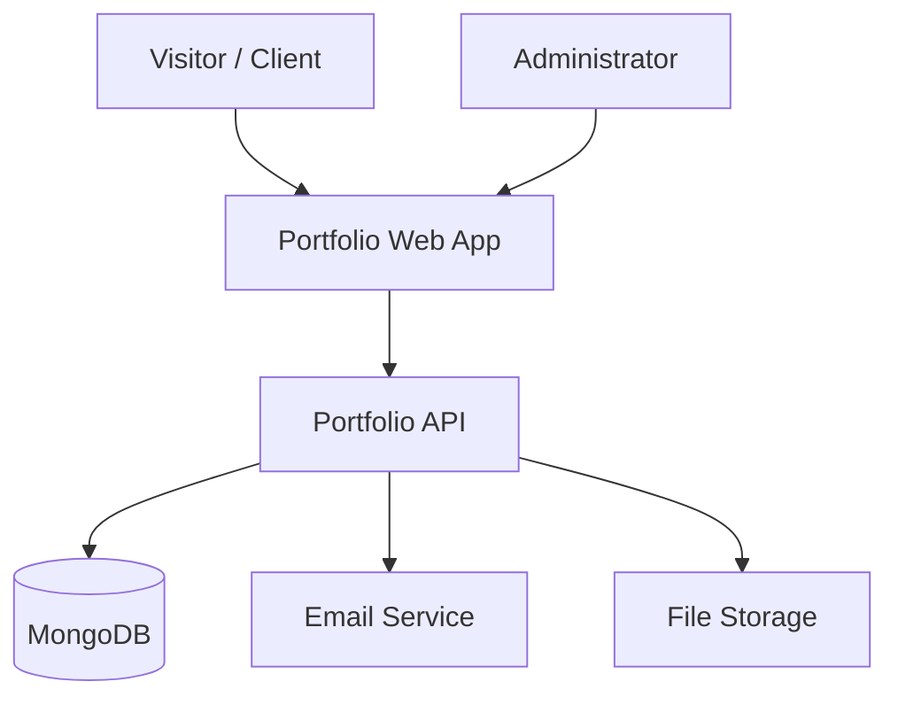
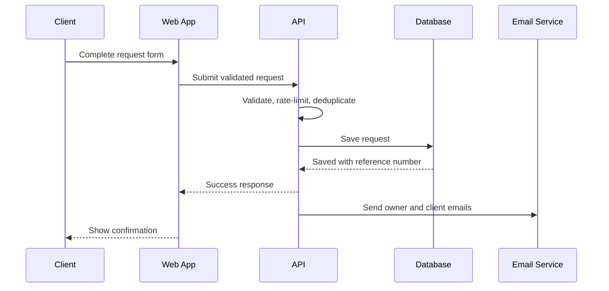

# System Architecture

## Nikhil Portfolio & Client Request Platform

**Document version:** 1.1  
**Architecture style:** React single-page application plus modular REST API

---

## 1. Architecture Objectives

The architecture should:

- Deliver public pages quickly.
- Support a premium, coordinated motion system without sacrificing usability or performance.
- Keep the project understandable for one developer.
- Securely accept project requirements and attachments.
- Preserve requests even when secondary services fail.
- Make admin functionality private and auditable.
- Allow future client dashboards, quotes, payments, and AI automation without rebuilding the core.

Version 1 should remain a modular monolith rather than introducing microservices.

---

## 2. Recommended Technology Stack

### Frontend

- React
- TypeScript
- Vite
- React Router
- Axios instance for API communication
- React Hook Form
- Zod for shared-style validation concepts
- Plain CSS with CSS variables, Grid, and Flexbox
- CSS transitions/keyframes plus a lightweight React motion layer where stateful orchestration is needed
- Vitest and React Testing Library
- Playwright for essential end-to-end tests

### Backend

- Node.js
- Express
- TypeScript
- MongoDB Atlas
- Mongoose
- Zod for request validation
- Secure HTTP-only admin session or short-lived access session with revocation support
- Pino or Winston structured logging
- Helmet, CORS, and rate limiting
- Resend as the preferred email API, with Nodemailer as an alternative
- Cloudinary or S3-compatible object storage for attachments
- Vitest/Jest and Supertest

### Delivery

- Frontend: Vercel or equivalent static/frontend hosting
- API: Render, Railway, or another managed Node.js runtime
- Database: MongoDB Atlas
- Source control and CI: GitHub and GitHub Actions
- Monitoring: provider health checks plus an error-monitoring service when available

---

## 3. Context Diagram



---

## 4. Container Responsibilities

### 4.1 Web application

Responsibilities:

- Render public content and admin interface.
- Manage navigation and page state.
- Validate user input for fast feedback.
- Submit requests to the API.
- Display loading, error, success, and empty states.
- Track privacy-safe product events.

The browser is not trusted for authorization or final validation.

### 4.2 API application

Responsibilities:

- Validate and normalize all input.
- Enforce rate limits, authentication, and authorization.
- Create and query project requests.
- Coordinate attachment metadata.
- Trigger notifications after persistence.
- Provide admin filtering, pagination, notes, and status updates.
- Produce structured logs and stable API responses.

### 4.3 MongoDB

Responsibilities:

- Persist project requests.
- Store admin identity/session information when required.
- Store contact messages, request status, notes, and notification state.
- Provide indexed filtering and sorting.

### 4.4 Object storage

Responsibilities:

- Store approved attachment bytes.
- Apply private or restricted access.
- Return stable storage identifiers.
- Support later cleanup based on data-retention rules.

### 4.5 Email service

Responsibilities:

- Send owner notifications.
- Send requester confirmations.
- Return delivery API results used for operational logs.

---

## 5. Frontend Architecture

Recommended source layout:

```text
frontend/src/
├── app/
│   ├── router.tsx
│   ├── providers.tsx
│   └── config.ts
├── assets/
├── components/
│   ├── common/
│   ├── layout/
│   ├── forms/
│   ├── motion/
│   └── feedback/
├── features/
│   ├── portfolio/
│   ├── project-request/
│   ├── contact/
│   └── admin/
├── hooks/
├── pages/
│   ├── public/
│   └── admin/
├── services/
│   ├── apiClient.ts
│   ├── projectRequestService.ts
│   └── authService.ts
├── styles/
│   ├── tokens.css
│   ├── motion.css
│   ├── global.css
│   └── utilities.css
├── types/
└── utils/
```

### Frontend design principles

- Organize domain-specific code by feature.
- Keep one configured Axios client for base URL, credentials, timeouts, and response normalization.
- Keep content data separate from reusable visual components.
- Keep motion durations, easing curves, reveal distances, and reduced-motion behavior centralized.
- Use URL routes for public pages and admin screens.
- Use local form state for the multi-step request flow; do not add a global state library until it is needed.
- Persist draft form state in session storage only if the privacy tradeoff is accepted; clear it after success.

---

## 5.1 Motion Architecture

Motion is a frontend presentation concern and must not be scattered as arbitrary values throughout components.

### Shared motion tokens

Define a small motion vocabulary:

```text
duration-instant   interaction confirmation
duration-fast      hover, press, focus, small state change
duration-base      menus, cards, form feedback
duration-slow      route and major section transitions

ease-standard      most movement
ease-enter         elements entering
ease-exit          elements leaving
ease-emphasis      rare hero or success moments
```

### Motion primitives

Create reusable components or hooks for:

- Page transition
- Section reveal
- Staggered group
- Hover-lift card
- Animated progress indicator where meaningful
- Form-step transition
- Reduced-motion preference

### Rendering rules

- Content must render in its final readable position before motion enhancement is applied.
- Intersection-based reveals should run once unless repeated behavior has a clear purpose.
- Avoid attaching heavy work directly to every scroll event.
- Use transforms and opacity for most animation.
- Disable parallax and nonessential movement for reduced-motion settings and low-capability situations.
- Route animation must not interfere with browser history, focus restoration, or scroll restoration.

### Performance verification

Test the homepage, project listing, case study, and request form on a mid-range phone-sized profile. Monitor long tasks, layout shifts, main-thread work, and image cost. Premium motion is accepted only when scrolling, typing, and navigation remain responsive.

---

## 6. Backend Architecture

Recommended source layout:

```text
backend/src/
├── app.ts
├── server.ts
├── config/
├── middleware/
│   ├── authenticate.ts
│   ├── authorize.ts
│   ├── errorHandler.ts
│   ├── rateLimiters.ts
│   └── validate.ts
├── modules/
│   ├── auth/
│   ├── projectRequests/
│   ├── contactMessages/
│   ├── notifications/
│   └── uploads/
├── shared/
│   ├── errors/
│   ├── logger/
│   ├── database/
│   └── utils/
├── templates/
└── types/
```

Each module should normally contain:

```text
routes → controller → service → repository/model
                       ↓
              external adapter when needed
```

### Layer responsibilities

| Layer | Responsibility |
|---|---|
| Route | HTTP path, middleware ordering, endpoint wiring |
| Controller | Translate HTTP input/output and call service |
| Service | Business rules and workflow coordination |
| Repository/model | Database operations |
| Adapter | External email or file-storage integration |

Controllers should remain thin. Business behavior should be testable without starting an HTTP server.

---

## 7. Request Submission Sequence



The core correctness rule is: **database persistence comes before email delivery**. Email failure must not cause loss of the client request.

For stronger reliability after the MVP, introduce an outbox collection and background worker:

```text
save request + notification event atomically
                ↓
        background worker
                ↓
      email success or retry
```

---

## 8. Data Model

### 8.1 ProjectRequest

Suggested fields:

```ts
type ProjectRequest = {
  _id: ObjectId;
  referenceNumber: string;
  serviceType: string;
  projectSize: string;
  budgetRange: string;
  title: string;
  description: string;
  existingSystem?: string;
  desiredOutcome: string;
  hasDesign?: "yes" | "no" | "partial" | "not_sure";
  desiredDeadline?: Date;
  referenceUrl?: string;
  contact: {
    name: string;
    email: string;
    phone?: string;
    company?: string;
    preferredMethod: "email" | "whatsapp" | "phone";
  };
  consent: {
    accepted: true;
    acceptedAt: Date;
  };
  status: ProjectRequestStatus;
  attachments: AttachmentMetadata[];
  notification: {
    ownerStatus: "pending" | "sent" | "failed";
    clientStatus: "pending" | "sent" | "failed";
    retryCount: number;
  };
  source?: {
    page?: string;
    campaign?: string;
  };
  archivedAt?: Date;
  createdAt: Date;
  updatedAt: Date;
};
```

Indexes:

- Unique index on `referenceNumber`
- Compound index on `status` and `createdAt`
- Index on `contact.email`
- Index on `serviceType` and `createdAt`
- Text or normalized search fields only if admin search requires it

### 8.2 AdminUser

```ts
type AdminUser = {
  _id: ObjectId;
  email: string;
  passwordHash: string;
  role: "admin";
  isActive: boolean;
  lastLoginAt?: Date;
  createdAt: Date;
  updatedAt: Date;
};
```

### 8.3 AdminNote

Store notes in a separate collection if history and pagination may grow. For a single-admin V1, an embedded bounded notes array is acceptable, but a separate collection is easier to extend.

---

## 9. API Contract Conventions

### Success response

```json
{
  "success": true,
  "data": {},
  "meta": {}
}
```

### Error response

```json
{
  "success": false,
  "error": {
    "code": "VALIDATION_ERROR",
    "message": "Please correct the highlighted fields.",
    "fields": {
      "contact.email": "Enter a valid email address."
    },
    "requestId": "public-correlation-id"
  }
}
```

Rules:

- Use stable machine-readable error codes.
- Do not expose database details or stack traces.
- Use correct HTTP status codes.
- Paginated endpoints return items plus page metadata.
- Set explicit request and body-size limits.

---

## 10. File Upload Design

Preferred V1 approach:

1. The browser selects files and validates obvious size/type problems.
2. The API receives multipart form data.
3. Upload middleware enforces strict limits.
4. The service uploads acceptable files to private object storage.
5. The API persists only verified metadata and storage identifiers.
6. Admin access to a file uses an authorized, time-limited URL when supported.

Do not:

- Trust only the filename extension.
- Save files using the original filename as a path.
- Expose the server upload directory publicly.
- Accept executable or script file types.
- Put storage credentials in frontend code.

An alternative two-stage direct-to-storage upload may be introduced later if file traffic grows.

---

## 11. Authentication and Session Design

Because Version 1 has only one private administrator, use the simplest secure design supported by the deployment topology.

Recommended approach:

- Admin email and strong password hash stored in the database.
- Login establishes a signed, HTTP-only, secure session cookie.
- Server-side authorization checks the active admin and role.
- Session lifetime is limited and renewed only according to an explicit policy.
- Logout invalidates the session.
- Strict login rate limiting and generic invalid-credential messages.

If frontend and API are on different origins, configure CORS credentials and cookie attributes carefully. Avoid storing long-lived admin tokens in local storage.

---

## 12. Security Architecture

### Trust boundaries

- Everything from the browser is untrusted.
- Public request endpoints are assumed to receive malicious traffic.
- External provider responses can fail, time out, or change.
- Admin authentication does not replace per-route authorization.

### Controls

- Zod validation and normalization
- Field and payload size limits
- Rate limits by endpoint class
- Honeypot and time-based spam signals
- CAPTCHA only when risk justifies added friction
- Helmet security headers
- Explicit origin allowlist
- Secure cookies
- Password hashing with Argon2id or bcrypt at an appropriate work factor
- Attachment restrictions
- Central error handling
- Redacted structured logging
- Secret management through deployment environment variables
- Dependency and static analysis in CI

---

## 13. Reliability and Observability

### Logs

Log:

- Request ID
- Route and method
- Status code
- Response time
- Project request reference number after creation
- External provider operation outcome
- Admin authentication events without secrets
- Unhandled errors with stack trace on the server only

Do not log full contact messages, passwords, cookies, tokens, or attachment contents.

### Health endpoints

- Liveness: process is running
- Readiness: application can reach required dependencies

### Failure handling

- Database failure: return a safe retryable error; do not claim success.
- Email failure after persistence: return request success, record email failure, and retry.
- File failure before request completion: clean up partial uploads where possible and show a precise error.
- Analytics failure: ignore without disrupting the user workflow.

---

## 14. Deployment Architecture

### Environments

- Local development
- Preview/staging
- Production

Each environment should use separate secrets, origins, and ideally separate databases/storage folders.

### CI pipeline

1. Install locked dependencies.
2. Format check.
3. Lint.
4. Type check.
5. Run unit and integration tests.
6. Build frontend and backend.
7. Run dependency/security checks.
8. Deploy only after required checks pass.

### Backup and recovery

- Enable managed database backups where available.
- Document database restore steps.
- Store source code in Git.
- Treat uploaded attachments as external durable data, not ephemeral server files.

---

## 15. Future Evolution

The modular monolith can add these modules without immediate service separation:

- Client accounts
- Quotes and quote versions
- Payments and invoices
- Projects and milestones
- Client messages
- Automation service ordering and automation-specific intake fields in Version 2
- AI requirement analysis
- Background jobs
- Productized service catalog

Split services only when deployment, scaling, reliability, or team ownership creates a measured need.

---

## 16. Key Architecture Decisions

| Decision | Reason |
|---|---|
| Modular monolith | Lowest operational complexity with clear expansion boundaries |
| React + TypeScript | Matches existing strengths and supports reliable component development |
| Plain CSS | Full design control without adding a utility framework |
| Central motion system | Creates a coherent premium feel while controlling performance and accessibility |
| Node/Express + TypeScript | Familiar backend with shared language across the stack |
| MongoDB | Fits flexible project-request records and existing experience |
| Persist before notification | Prevents email failure from losing leads |
| Private object storage | Keeps client attachments out of public application assets |
| No payment or AI in V1 | Keeps the first release focused on lead conversion and reliability |
| Automation service begins in V2 | Keeps the first service catalog aligned with immediately deliverable work |
